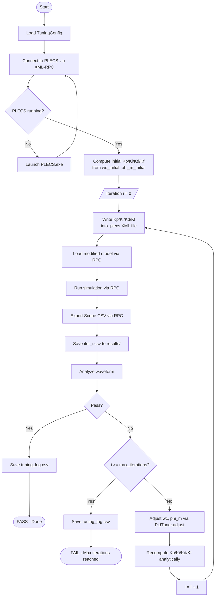
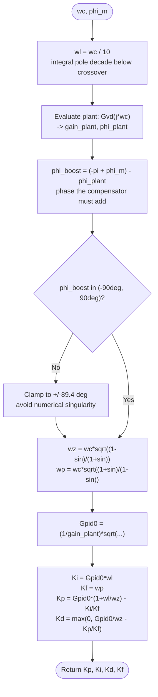
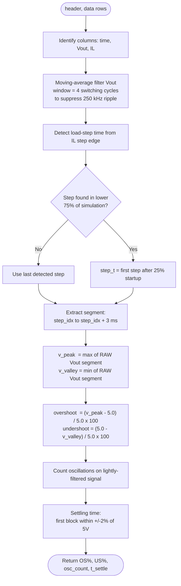
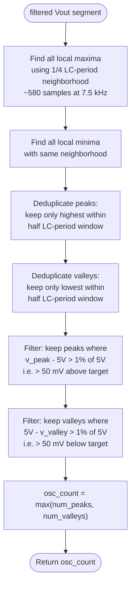
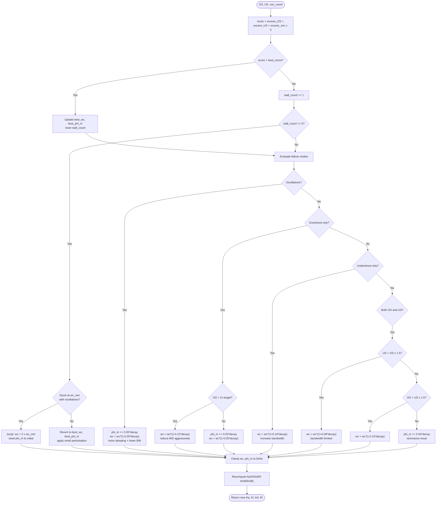

# PLECS Buck Converter PID Auto-Tuner

Automated PID tuning system for a synchronous buck converter simulated in PLECS. Uses analytical Type 3 compensator design to find optimal PID parameters by adjusting two design variables — crossover frequency (`wc`) and phase margin (`phi_m`) — instead of searching through all four PID gains independently.

---

## Table of Contents

1. [System Overview](#system-overview)
2. [File Structure](#file-structure)
3. [Circuit Parameters](#circuit-parameters)
4. [Theory: Type 3 Compensator Design](#theory-type-3-compensator-design)
5. [Algorithm Flowcharts](#algorithm-flowcharts)
6. [Response Analysis](#response-analysis)
7. [Tuning Strategy](#tuning-strategy)
8. [GUI](#gui)
9. [Installation & Usage](#installation--usage)
10. [Configuration](#configuration)
11. [Output Files](#output-files)

---

## System Overview

The tuner connects to PLECS via XML-RPC, modifies the controller parameters in the `.plecs` model file, runs a time-domain simulation, reads the output voltage waveform, and iteratively adjusts the controller until the load-step transient response meets the performance targets.

**Performance targets (defaults):**

| Metric | Target |
|---|---|
| Overshoot | < 5% |
| Undershoot | < 5% |
| Oscillations after step | <= 2 |

---

## File Structure

```
Plecs/
├── auto_tune.py            # Core tuning engine (all classes)
├── analyze.py              # Post-processing: animation, plots
├── gui.py                  # PyQt5 real-time GUI
├── synchronous buck.plecs  # PLECS model (modified each iteration)
├── auto_tune.pls           # PLECS simulation script (Octave/MATLAB)
├── demo.py                 # Quick demo / smoke test
├── results/
│   ├── iter_000.csv        # Scope data for iteration 0
│   ├── iter_001.csv        # ...
│   ├── tuning_log.csv      # Summary: all iterations & metrics
│   ├── animation.gif       # Animated waveform evolution
│   ├── metrics.png         # OS/US/oscillation progression
│   └── path.png            # wc/phi_m search path
└── plecs-rpc-scope-export/ # Utility scripts for PLECS RPC
```

---

## Circuit Parameters

The buck converter being tuned:

| Parameter | Symbol | Value |
|---|---|---|
| Input voltage | Vdc | 12 V |
| Output voltage | Vout | 5 V |
| Inductance | L | 30 µH |
| Output capacitance | C | 15 µF |
| Capacitor ESR | Rc | 7.5 mΩ |
| Inductor DCR | Rl | 50 mΩ |
| Switching frequency | fsw | 250 kHz |

**Derived plant characteristics:**

| Parameter | Formula | Value |
|---|---|---|
| LC resonant frequency | f0 = 1/(2π√LC) | 7.5 kHz |
| Quality factor | Q = √(L/C) / (Rc + Rl) | 24.6 (lightly damped) |
| ESR zero | fesr = 1/(2π·Rc·C) | 1.41 MHz |
| DC gain | Gvd0 = Vdc | 12 |

The high Q factor (24.6) means the converter is very lightly damped near resonance — the compensator must provide enough phase margin to stabilize it.

---

## Theory: Type 3 Compensator Design

### Plant Transfer Function

The control-to-output transfer function (duty cycle → Vout) is:

```
         Gvd0 · (1 + s/ωesr)
Gvd(s) = ─────────────────────────────────
          1 + s/(Q·ω0) + (s/ω0)²
```

This is a second-order system with:
- A double pole at ω0 (–40 dB/dec rolloff, –180° phase shift)
- A zero from capacitor ESR at ωesr (recovers +20 dB/dec)

### Compensator Topology (PLECS Parallel PID)

```
C(s) = Kp + Ki/s + Kd·Kf·s/(s + Kf)
```

- `Ki/s` — integrator: forces zero steady-state error
- `Kp` — proportional gain
- `Kd·Kf·s/(s+Kf)` — filtered derivative: adds phase boost, with `Kf` limiting high-frequency gain

This structure is equivalent to a Type 3 compensator with two zeros and two poles (plus the integrator pole at origin).

### Two Design Variables → Four PID Parameters

Rather than searching a 4-dimensional space, all four gains are computed analytically from just two design variables:

| Variable | Symbol | Meaning | Range |
|---|---|---|---|
| Crossover frequency | wc | Where open-loop gain = 0 dB | [15 kHz, 50 kHz] (rad/s: 94,248 – 314,159) |
| Phase margin | phi_m | Stability margin at crossover | [30°, 80°] |

### Analytical Design Equations

**Step 1 — Integral pole placement:**
```
ωl = wc / 10
```
Place the integrator decade below crossover to avoid phase penalty at crossover.

**Step 2 — Evaluate plant at crossover:**
```
Gvd(j·wc) → gain_plant = |Gvd(j·wc)|,  phi_plant = ∠Gvd(j·wc)
```

**Step 3 — Required phase boost:**
```
phi_boost = (–π + phi_m) – phi_plant
```
The compensator must supply enough phase to achieve the desired phase margin.

**Step 4 — Lead-lag zero and pole:**
```
wz = wc · √((1 – sin(phi_boost)) / (1 + sin(phi_boost)))
wp = wc · √((1 + sin(phi_boost)) / (1 – sin(phi_boost)))
```
These place the compensator zero (wz) and pole (wp) symmetrically around wc to maximise phase at crossover.

**Step 5 — Controller gain for unity crossover:**
```
Gpid0 = (1 / gain_plant) · √((1 + (wc/wp)²) / (1 + (wc/wz)²))
```

**Step 6 — Convert to PID parameters:**
```
Ki = Gpid0 · ωl
Kf = wp
Kp = Gpid0 · (1 + ωl/wz) – Ki/Kf
Kd = max(0, Gpid0/wz – Kp/Kf)   ← clamped: negative Kd is unstable
```

**Reference design** (wc = fsw/10 = 25 kHz, phi_m = 60°):

| | Kp | Ki | Kd | Kf |
|---|---|---|---|---|
| Value | 0.31703 | 3764.63 | 4.785×10⁻⁶ | 551,786 |

---

## Algorithm Flowcharts

### Top-Level Auto-Tune Loop



---

### Compensator Design (CompensatorDesign.compute)



---

### Response Analysis (ResponseAnalyzer.analyze)



---

### Oscillation Counter



---

### PID Tuner Adjustment (PidTuner.adjust)



---

## Response Analysis

### Overshoot and Undershoot Definition

Both metrics are computed from the **raw (unfiltered)** Vout waveform in the transient window immediately after the detected load step:

```
v_peak   = max(Vout[step_idx : step_idx + 3 ms])
v_valley = min(Vout[step_idx : step_idx + 3 ms])

overshoot  = max(0,  v_peak   – 5.0) / 5.0 × 100 %
undershoot = max(0,  5.0 – v_valley) / 5.0 × 100 %
```

The reference is the **nominal setpoint (5.0 V)**, not the pre-step average. Because the converter is closed-loop, the pre-step steady state is very close to 5.0 V, so the difference is negligible. Raw data is used (not filtered) because filtering with a wide window would reduce the visible peak/valley amplitude and underestimate the true excursion.

**Note:** Switching ripple (~50–100 mV peak-to-peak at 250 kHz) adds a small bias of ~0.5–1% to both numbers. This is inherent to using peak/valley of the raw signal.

### Oscillation Counting

Oscillations are counted on the **lightly filtered** signal (4-cycle moving average) to remove switching ripple while preserving the envelope oscillations:

1. Local peaks/valleys are found using a neighbourhood of ¼ LC period (~33 µs, ~580 samples) — wide enough to ignore ripple bumps
2. Duplicate detections within ½ LC period are merged (keep the most extreme)
3. Only peaks/valleys that deviate more than 1% (50 mV) from 5 V are kept — avoids counting settled residual noise

---

## Tuning Strategy

The 2D search space and the rule-based adjustments:

| Failure mode | Action | Physical reasoning |
|---|---|---|
| Oscillations (osc > 2) | phi_m ↑, wc ↓ slightly | More phase margin damps the resonance |
| High overshoot (OS > target) | wc ↓ | Lower bandwidth = slower, less overshoot |
| Very high overshoot (OS > 2× target) | wc ↓↓ aggressively | Get far from resonance quickly |
| Moderate overshoot | phi_m ↑, wc ↓ slightly | Phase-margin-limited damping |
| Undershoot only | wc ↑ | Higher bandwidth = faster recovery |
| Both OS and US | phi_m ↑ | Suggests near-resonance: add damping |
| Stall (5 consecutive non-improvements) | Revert to best + small perturbation | Escape local plateau |
| Stuck at wc_min with oscillations | Jump to 2×wc_min | Escape resonance singularity |

**Decay factor:** adjustment step sizes scale as `max(0.2, 1 – 0.05×iteration)`, reducing aggressiveness as iterations progress to refine rather than overshoot the optimum.

**Score function:** `score = excess_OS + excess_US + excess_osc × 3`
Oscillations are weighted 3× heavier because they are harder to fix and indicate fundamental stability problems.

---

## GUI

Launch with:

```
python gui.py
```

```
+-----------------------------------------------+
|  Left panel (scrollable, 350px)               |
|  - Circuit screenshot (captured from PLECS)   |
|  - PID parameter spinboxes (Kp/Ki/Kd/Kf)     |
|  - Design variable spinboxes (wc, phi_m)      |
|    + [Compute PID] button                     |
|  - Target spinboxes (OS%, US%, max_osc, iter) |
|  - Control buttons:                           |
|    [Start Auto-Tune]  [Run Single Iteration]  |
|    [Pause] [Resume] [Stop]                    |
|    [Save Animation GIF]  [Reset to Defaults]  |
|  - Log text area                              |
+-----------------------------------------------+
|  Right panel (stretches)                      |
|  - Live waveform canvas (dark theme)          |
|    - Current iteration waveform               |
|    - Ghost traces of previous iterations      |
|    - OS/US shaded bands (dynamically sized)   |
|    - Peak/valley scatter markers              |
|  - Metrics canvas                             |
|    - OS/US % vs iteration number (line chart) |
|    - Oscillation count vs iteration (bar)     |
+-----------------------------------------------+
| Status bar: "Iter 5 — FAIL — OS=3.2% US=6.7%"|
+-----------------------------------------------+
```

The PID spinboxes update live as each iteration completes. During auto-tune they become read-only; after stop/finish they are editable again for manual exploration.

---

## Installation & Usage

### Prerequisites

- Python 3.10+
- PLECS 5.0 (64-bit) installed at the path in `TuningConfig.plecs_exe`
- Python packages:

```
pip install PyQt5 matplotlib numpy
```

### Run the GUI

```bash
python gui.py
```

### Run the CLI tuner directly

```bash
python auto_tune.py
```

### Generate visualizations from saved results

```bash
python analyze.py
```

This reads all `results/iter_*.csv` files and `results/tuning_log.csv` and produces:
- `results/animation.gif` — animated waveform evolution across all iterations
- `results/metrics.png` — OS/US/oscillation trends
- `results/path.png` — search path in (wc, phi_m) space

---

## Configuration

All tuning parameters live in the `TuningConfig` dataclass in `auto_tune.py`:

| Field | Default | Description |
|---|---|---|
| `plecs_exe` | PLECS 5.0 path | Path to PLECS executable |
| `plecs_model` | `synchronous buck.plecs` | Source model file |
| `rpc_url` | `http://127.0.0.1:1080/RPC2` | PLECS XML-RPC endpoint |
| `results_dir` | `results/` | Where to save CSVs and logs |
| `target_overshoot` | 5.0 % | Max acceptable overshoot |
| `target_undershoot` | 5.0 % | Max acceptable undershoot |
| `max_oscillations` | 2 | Max acceptable oscillation count |
| `max_iterations` | 30 | Iteration budget |
| `wc_min` | 94,248 rad/s (15 kHz) | Minimum crossover freq (= 2×f0, below this equations become singular near LC resonance) |
| `wc_max` | 314,159 rad/s (50 kHz) | Maximum crossover freq (= fsw/5) |
| `wc_initial` | 94,248 rad/s | Starting crossover freq |
| `phi_m_min` | 0.524 rad (30°) | Minimum phase margin |
| `phi_m_max` | 1.396 rad (80°) | Maximum phase margin |
| `phi_m_initial` | 0.524 rad (30°) | Starting phase margin |

The default starting point (wc=15 kHz, phi_m=30°) is intentionally poor (near resonance, low damping) to demonstrate the tuner's ability to recover. A nominal starting point would be wc=25 kHz, phi_m=60°.

---

## Output Files

| File | Content |
|---|---|
| `results/iter_NNN.csv` | Raw PLECS scope data for iteration N: columns are `Time`, `IL` (inductor current), `Vout` (output voltage) |
| `results/tuning_log.csv` | One row per iteration: iter, Kp, Ki, Kd, Kf, overshoot, undershoot, osc_count, settling_time, status |
| `results/animation.gif` | Dark-theme animated plot showing waveform evolution with ghost traces and OS/US bands |
| `results/metrics.png` | Two subplots: OS/US % vs iteration, oscillation count vs iteration |
| `results/path.png` | Scatter plot of (wc, phi_m) search path, colored by iteration number |
