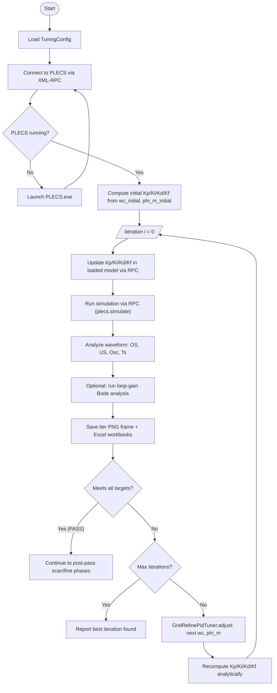
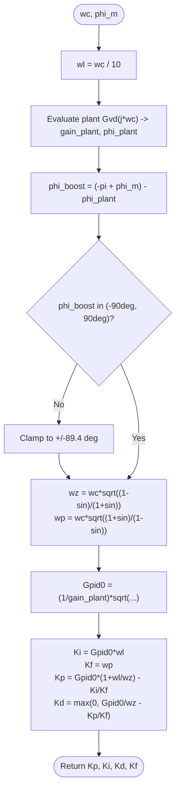
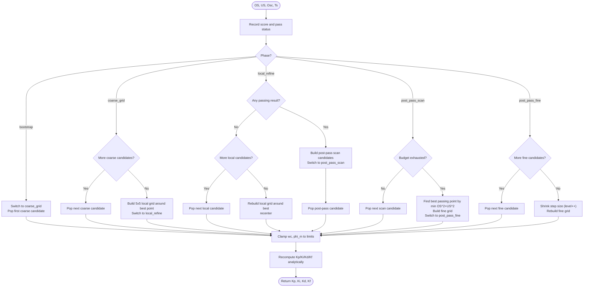
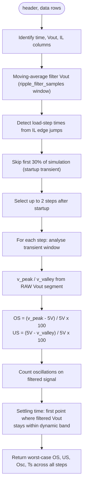

# PLECS Buck Converter PID Auto-Tuner

Automated PID tuning system for a synchronous buck converter simulated in PLECS. Uses analytical Type 3 compensator design to find optimal PID parameters by searching over two design variables — crossover frequency (`wc`) and phase margin (`phi_m`) — instead of searching through all four PID gains independently. After each time-domain simulation, a loop-gain Bode analysis is optionally run to measure the actual crossover frequency, phase margin, and gain margin.

---

## Table of Contents

1. [System Overview](#system-overview)
2. [File Structure](#file-structure)
3. [Circuit Parameters](#circuit-parameters)
4. [Theory: Type 3 Compensator Design](#theory-type-3-compensator-design)
5. [Algorithm: Grid-Refine Search](#algorithm-grid-refine-search)
6. [Algorithm Flowcharts](#algorithm-flowcharts)
7. [Response Analysis](#response-analysis)
8. [GUI](#gui)
9. [Installation & Usage](#installation--usage)
10. [Configuration](#configuration)
11. [Output Files](#output-files)

---

## System Overview

The tuner connects to PLECS via XML-RPC, updates the controller gains in the loaded model, runs a time-domain simulation, reads the output voltage waveform directly from the simulation result, and iteratively adjusts the controller until the load-step transient response meets all performance targets.

**Performance targets (defaults):**

| Metric | Target |
|---|---|
| Overshoot | < 4% |
| Undershoot | < 4% |
| Oscillations after step | 0 |
| Settling time | ≤ 0.1 ms |

---

## File Structure

```
plecs-pid-autotuner/
├── auto_tune.py              # Core tuning engine: all classes and orchestration
├── gui.py                    # PyQt5 real-time GUI
├── bode_plot.py              # Loop-gain frequency response analysis
├── iteration_export.py       # Per-iteration PNG frames and Excel workbooks
├── analyze.py                # Post-processing: animation GIF, trend plots
├── synchronous buck.plecs    # PLECS model (parameters updated each iteration)
├── synchronous buck.png      # Circuit screenshot shown in GUI
└── results/
    ├── figures_MMDD_HHMM/    # Timestamped run folder
    │   ├── iter1.png         # Waveform + Bode frame for iteration 1
    │   ├── iter2.png         # ...
    │   ├── best_iteration.png
    │   ├── animation.gif
    │   ├── data_time_iterations.xlsx   # Summary + per-iteration waveform data
    │   └── data_bode_iterations.xlsx  # Bode metrics + per-iteration frequency data
    └── ...                   # Up to 5 recent run folders are kept
```

---

## Circuit Parameters

| Parameter | Symbol | Value |
|---|---|---|
| Input voltage | Vdc | 12 V |
| Output voltage | Vout | 5 V |
| Inductance | L | 30 µH |
| Output capacitance | C | 15 µF |
| Capacitor ESR | Rc | 7.5 mΩ |
| Inductor DCR | Rl | 50 mΩ |
| Switching frequency | fsw | 250 kHz |

**Derived plant characteristics:**

| Parameter | Formula | Value |
|---|---|---|
| LC resonant frequency | f0 = 1/(2π√LC) | 7.5 kHz |
| Quality factor | Q = √(L/C) / (Rc + Rl) | 24.6 (lightly damped) |
| ESR zero | fesr = 1/(2πRcC) | 1.41 MHz |
| DC gain | Gvd0 = Vdc | 12 |

The high Q factor (24.6) means the converter is very lightly damped near resonance — the compensator must provide enough phase margin to stabilise it.

---

## Theory: Type 3 Compensator Design

### Plant Transfer Function

The control-to-output transfer function (duty cycle → Vout) is:

```
         Gvd0 · (1 + s/ωesr)
Gvd(s) = ─────────────────────────────────
          1 + s/(Q·ω0) + (s/ω0)²
```

- Double pole at ω0 (–40 dB/dec rolloff, –180° phase shift)
- ESR zero at ωesr (recovers +20 dB/dec)

### Compensator Topology (PLECS Parallel PID)

```
C(s) = Kp + Ki/s + Kd·Kf·s/(s + Kf)
```

- `Ki/s` — integrator: forces zero steady-state error
- `Kp` — proportional gain
- `Kd·Kf·s/(s+Kf)` — filtered derivative: adds phase boost, `Kf` limits high-frequency gain

This is equivalent to a Type 3 compensator with two zeros and two poles (plus the integrator pole at origin).

### Two Design Variables → Four PID Parameters

| Variable | Symbol | Meaning | Range |
|---|---|---|---|
| Crossover frequency | wc | Where open-loop gain = 0 dB | 15 kHz – 50 kHz (rad/s: 94,248 – 314,159) |
| Phase margin | phi_m | Stability margin at crossover | 30° – 80° |

### Analytical Design Equations

**Step 1 — Integral pole placement:**
```
ωl = wc / 10
```

**Step 2 — Evaluate plant at crossover:**
```
Gvd(j·wc) → gain_plant = |Gvd(j·wc)|,  phi_plant = ∠Gvd(j·wc)
```

**Step 3 — Required phase boost:**
```
phi_boost = (–π + phi_m) – phi_plant
```

**Step 4 — Lead-lag zero and pole:**
```
wz = wc · √((1 – sin(phi_boost)) / (1 + sin(phi_boost)))
wp = wc · √((1 + sin(phi_boost)) / (1 – sin(phi_boost)))
```

**Step 5 — Controller gain for unity crossover:**
```
Gpid0 = (1 / gain_plant) · √((1 + (wc/wp)²) / (1 + (wc/wz)²))
```

**Step 6 — Convert to PID parameters:**
```
Ki = Gpid0 · ωl
Kf = wp
Kp = Gpid0 · (1 + ωl/wz) – Ki/Kf
Kd = max(0, Gpid0/wz – Kp/Kf)   ← clamped: negative Kd is unstable
```

**Reference design** (wc = fsw/10 = 25 kHz, phi_m = 60°):

| | Kp | Ki | Kd | Kf |
|---|---|---|---|---|
| Value | 0.31703 | 3764.63 | 4.785×10⁻⁶ | 551,786 |

---

## Algorithm: Grid-Refine Search

The tuner (`GridRefinePidTuner`) replaces a simple heuristic hill-climber with a structured multi-phase search over the 2D (wc, phi_m) space. All four PID gains are recomputed analytically at every candidate point.

### Search Phases

| Phase | Description |
|---|---|
| **Bootstrap** | Evaluate the initial (wc, phi_m) point |
| **Coarse grid** | Sweep a 5×4 grid across the full wc/phi_m range (20 evaluations); wc points are logarithmically spaced, phi_m points are linearly spaced |
| **Local refine** | 5×5 grid (±12% wc, ±8° phi_m) centred on the best coarse point |
| **Post-pass scan** | After the first passing result, scan 20 more points around the passing region |
| **Post-pass fine** | Progressively shrinking rings around the best passing point to minimise OS²+US² |

### Score Function

```
score = excess_OS + excess_US + excess_osc × 3 + excess_Ts × 10000
```

Oscillations are weighted 3× because they indicate fundamental stability problems. Settling time is weighted heavily to ensure it is genuinely met, not just close.

### Best Result Selection

Among all passing iterations, the best is chosen by:

1. Smallest OS² + US² (balanced, low deviation)
2. Smallest worst-case deviation (min of max(OS, US))
3. Smallest OS + US
4. Fewest oscillations
5. Fastest settling time
6. Earliest iteration number (tie-break)

---

## Algorithm Flowcharts

### Top-Level Auto-Tune Loop



### Compensator Design (CompensatorDesign.compute)



### Grid-Refine Search (GridRefinePidTuner.adjust)



### Response Analysis (ResponseAnalyzer.analyze)



---

## Response Analysis

### Overshoot and Undershoot

Measured from **raw (unfiltered)** Vout in the transient window after each detected load step:

```
overshoot  = max(0, v_peak   – 5.0) / 5.0 × 100 %
undershoot = max(0, 5.0 – v_valley) / 5.0 × 100 %
```

Both step-up and step-down transients are analysed; the worst-case values are reported.

### Oscillation Counting

Oscillations are counted on the **lightly filtered** signal to remove switching ripple while preserving the envelope oscillations:

1. Local peaks/valleys found using a ¼ LC-period neighbourhood (~33 µs)
2. Duplicates within ½ LC period merged (keep most extreme)
3. Only peaks/valleys deviating > 1% (50 mV) from 5 V are counted

### Settling Time

Uses an adaptive band derived from the ripple amplitude at the tail of the analysis window, with a minimum of ±10 mV. The signal must stay inside both the filtered band and a raw peak-to-peak ripple limit before settling is declared — this prevents a ringing waveform that averages to 5 V from being called settled too early.

### Bode Analysis

After each time-domain simulation, a loop-gain frequency response is optionally extracted using PLECS's built-in analysis tool:

1. The 1A load pulse generator is temporarily commented out (steady-state operating point)
2. A coarse sweep ("Loop Gain (Frequency Response)") is run across the configured range
3. A dense sweep ("Loop Gain (Peak Dense)") adds resolution around the crossover region
4. The two sweeps are merged and the following metrics are computed:
   - **fc** — gain crossover frequency (0 dB crossing)
   - **PM** — phase margin (180° + phase at fc)
   - **GM** — gain margin (–magnitude at –180° phase crossing)

---

## GUI

Launch with:

```
python gui.py
```

```
+--------------------------------------------+------------------------------------------+
|  Left panel (scrollable)                   |  Right panel                             |
|                                            |                                          |
|  Circuit screenshot                        |  [Waveform canvas]  [Bode canvas]        |
|                                            |   Live Vout trace    Magnitude (dB)      |
|  PID Parameters                            |   Ghost traces       Phase (deg)         |
|    Kp / Ki / Kd / Kf spinboxes            |   OS/US bands        fc / PM / GM        |
|                                            |                                          |
|  Design Variables                          |  [Metrics canvas]                        |
|    wc (rad/s) / phi_m (deg) spinboxes     |   OS% / US% trend                        |
|    [Compute PID from wc / phi_m]           |   Oscillation count bar                  |
|                                            |   Settling time trend                    |
|  Targets                                   |                                          |
|    OS% / US% / Max Osc / Max Ts / Iter    +------------------------------------------+
|                                            |
|  Bode Analysis                             |
|    [x] Run bode plot analysis              |
|    Start f / Stop f / Extraction Cycles   |
|    Coarse Points / Dense Points           |
|                                            |
|  Controls                                  |
|    [Start Auto-Tune]                       |
|    [Run Single Iteration]                  |
|    [Pause]  [Resume]  [Stop]              |
|    [Save Animation GIF]                    |
|    [Reset to Defaults]                     |
|                                            |
|  Log                                       |
+--------------------------------------------+
| Status bar: "Iter 5 — FAIL — OS=3.2% ..." |
+--------------------------------------------+
```

### Auto-Tune

Runs the full `GridRefinePidTuner` search autonomously for up to `max_iterations` iterations. On completion, the GUI switches to display the best iteration found (lowest OS²+US²). PID spinboxes become read-only during the run.

### Run Single Iteration

Runs one simulation using the current PID spinbox values, then automatically computes the next set of parameters via `tuner.adjust()` and updates the spinboxes. Pressing again steps to the next iteration — this allows manually stepping through the same search sequence as Auto-Tune, one iteration at a time. The tuner state (search phase, visited designs) is preserved between presses.

### Model Sync

Whenever any spinbox value changes, the `.plecs` model file is updated on disk (150 ms debounce) with the new PID gains and Bode analysis settings. This keeps the PLECS file in sync with the GUI at all times.

---

## Installation & Usage

### Prerequisites

- Python 3.10+
- PLECS 5.0 (64-bit) installed at the path configured in `TuningConfig.plecs_exe`
- Python packages:

```
pip install PyQt5 matplotlib numpy Pillow xlsxwriter
```

### Run the GUI

```bash
python gui.py
```

### Run the CLI tuner directly

```bash
python auto_tune.py
```

### Generate visualisations from saved results

```bash
python analyze.py
```

Reads `results/figures_*/` frame images and Excel workbooks and produces:
- `animation.gif` — animated waveform evolution across all iterations
- `metrics.png` — OS/US/oscillation/settling-time trends
- `path.png` — Kp/Ki/Kd/Kf search path scatter plots
- `best_iteration.png` — frame for the best iteration

---

## Configuration

All tuning parameters live in the `TuningConfig` dataclass in `auto_tune.py`:

| Field | Default | Description |
|---|---|---|
| `plecs_exe` | PLECS 5.0 path | Path to PLECS executable |
| `plecs_model` | `synchronous buck.plecs` | Source model file |
| `rpc_url` | `http://127.0.0.1:1080/RPC2` | PLECS XML-RPC endpoint |
| `results_dir` | `results/` | Root folder for run subfolders |
| `sim_time_span` | `3e-3` | Simulation duration (s) |
| `load_pulse_frequency` | `250` | Load pulse frequency (Hz) |
| `load_pulse_duty_cycle` | `0.25` | Load pulse duty cycle |
| `load_pulse_delay` | `1e-3` | Delay before first load step (s) |
| `target_overshoot` | 4.0 % | Max acceptable overshoot |
| `target_undershoot` | 4.0 % | Max acceptable undershoot |
| `max_oscillations` | 0 | Max acceptable oscillation count |
| `target_settling_time` | 1×10⁻⁴ s (0.1 ms) | Max acceptable settling time |
| `max_iterations` | 40 | Iteration budget |
| `bode_freq_start_hz` | 1,000 Hz | Bode sweep start frequency |
| `bode_freq_stop_hz` | 100,000 Hz | Bode sweep stop frequency |
| `bode_extraction_cycles` | 30 | Cycles per frequency point |
| `bode_coarse_num_points` | 51 | Points in the coarse sweep |
| `bode_dense_num_points` | 51 | Points in the dense sweep |
| `wc_min` | 94,248 rad/s (15 kHz) | Min crossover freq (= 2×f0) |
| `wc_max` | 314,159 rad/s (50 kHz) | Max crossover freq (= fsw/5) |
| `wc_initial` | 94,248 rad/s | Starting crossover freq |
| `phi_m_min` | 0.524 rad (30°) | Min phase margin |
| `phi_m_max` | 1.396 rad (80°) | Max phase margin |
| `phi_m_initial` | 0.524 rad (30°) | Starting phase margin |

The default starting point (wc = 15 kHz, phi_m = 30°) is intentionally poor — near resonance with low damping — to demonstrate the tuner's ability to recover. A good nominal starting point would be wc = 25 kHz, phi_m = 60°.

---

## Output Files

Each auto-tune or single-iteration run writes into a timestamped subfolder under `results/`. Up to 5 recent run folders are kept; older ones are pruned automatically.

| File | Content |
|---|---|
| `results/figures_MMDD_HHMM/iter{N}.png` | Side-by-side waveform + Bode plot for iteration N |
| `results/figures_MMDD_HHMM/best_iteration.png` | Copy of the best iteration frame |
| `results/figures_MMDD_HHMM/animation.gif` | Animated waveform evolution |
| `results/figures_MMDD_HHMM/data_time_iterations.xlsx` | Summary sheet + per-iteration waveform data (Time, IL, Vout) |
| `results/figures_MMDD_HHMM/data_bode_iterations.xlsx` | Bode summary (fc, PM, GM) + per-iteration frequency response data |
